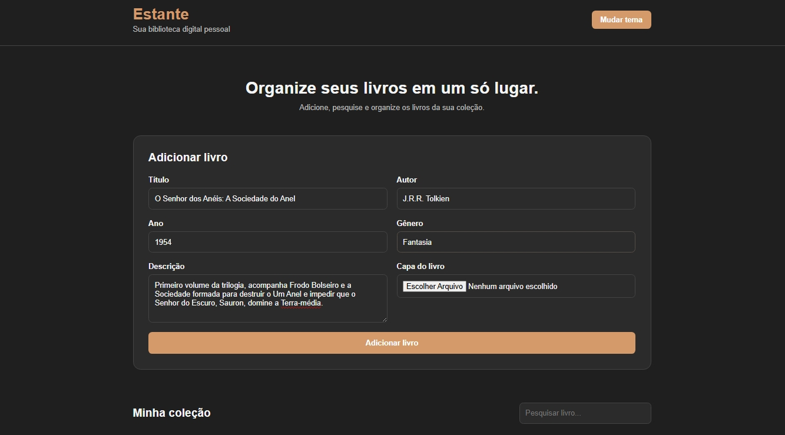
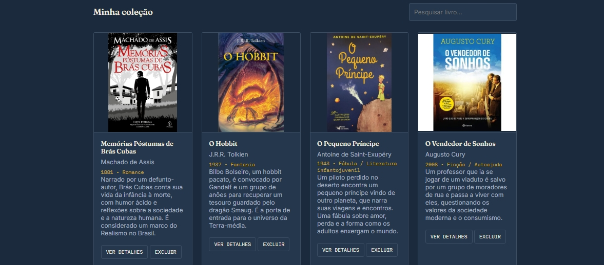
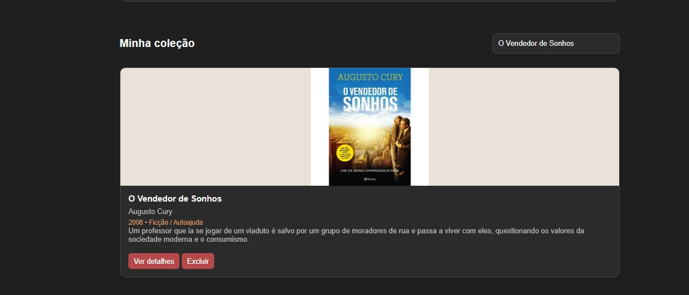
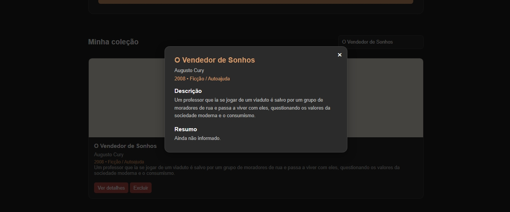

# Estante

Projeto desenvolvido por Pedro Henrique Américo Brandão.

Sua biblioteca digital pessoal — organize, pesquise e explore seus livros em um só lugar.

## Acesse aqui

[Estante Digital]([https://americobrandaop-boop.github.io/estante-digital/](https://estante-apb.netlify.app/))

## Funcionalidades

- Cadastro de livros com título, autor, ano, gênero, descrição e capa
- Busca por título ou autor
- Modal com detalhes de cada livro
- 3 temas visuais: claro, escuro e papel
- Armazenamento dos livros utilizando LocalStorage

## Screenshots

### Tela inicial e cadastro

### Minha coleção

### Busca

### Detalhes do livro

## Tecnologias

- HTML5
- CSS3
- JavaScript
- LocalStorage
